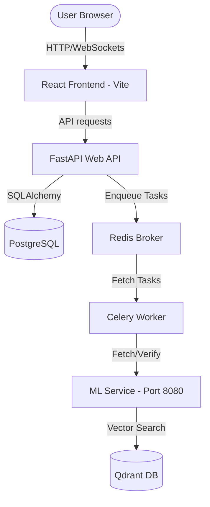

# Reel Truth Checker 🔍🤖

[](https://github.com/your-username/reel-truth-checker/actions/workflows/ci-cd.yml)
[](https://fastapi.tiangolo.com)
[](https://react.dev)
[](https://qdrant.tech)
[](LICENSE)

**Reel Truth Checker** is a full-stack, AI-powered system designed to analyze Instagram accounts for trust/safety and fact-check Instagram Reels. By combining natural language processing (NLP), computer vision, vector search (RAG), and multimodal fusion, it flags misinformation, extracts claims, verifies them against reference databases, and visualizes explainable predictions for users.

---

## 🌟 Key Features

### 👤 1. Account Safety Analysis
*   **Trust Score calculation** based on account metadata, age, and activity metrics.
*   **Risk Profile evaluation** checking post frequency, engagement deviation, and potential bot behavior.
*   **Safety Signals** detailing specific indicators such as suspicious bios, automated posting intervals, or high-risk content.

### 🎬 2. Reel Fact-Checking
*   **Automatic Transcription & Audio Extraction** to get spoken claims from the media.
*   **Claim Extraction** using ML models to parse transcripts into distinct verifiable claims.
*   **RAG (Retrieval-Augmented Generation) claim verification** against cached facts or databases using Qdrant Vector DB.
*   **Multimodal Fusion** to analyze visual overlays, spoken text, and metadata jointly.
*   **Explainable AI (XAI)** showing LIME/SHAP feature attributions on how the misinformation classification was reached.

### 📊 3. Interactive Dashboards
*   **Trust & Safety Console**: View aggregate account safety statistics, developer API logs, and billing logs.
*   **Intelligence Panel**: Inspect multimodal claims, RAG retrieval scores, explainability plots, and source verification links.

---

## 🏗️ System Architecture

The application is structured as a microservice system containing:
*   **Frontend**: React, TypeScript, TailwindCSS, and Chart.js.
*   **Web API (Backend)**: FastAPI (Python 3.11), SQLAlchemy, PostgreSQL database.
*   **Background Jobs**: Celery worker, Redis broker for long-running media processing.
*   **ML Service**: FastAPI (Python 3.10), PyTorch, Sentence-Transformers, Qdrant Vector DB.



---

## 📂 Repository Structure

```directory
.
├── .github/workflows/      # CI/CD Workflows (GitHub Actions)
├── backend/                # FastAPI backend & Celery configuration
│   ├── app/                # Main application source code
│   │   ├── agents/         # AI-agent routines for fact-checking
│   │   ├── api/            # Route controllers (Auth, Jobs, Results, etc.)
│   │   ├── core/           # Settings, exception handlers, rate limiter
│   │   └── database/       # DB session and base schemas
│   └── ml/                 # Machine Learning models and serving logic
│       ├── evaluation/     # Model evaluation scripts
│       ├── explainability/ # SHAP/LIME feature attribution
│       ├── models/         # Claim extractor, verifier, multimodal models
│       ├── rag/            # Qdrant vector store and RAG retriever
│       └── serving/        # FastAPI ML endpoint launcher (Port 8080)
├── data/                   # Train/Test datasets
└── src/                    # React + TypeScript frontend code
    ├── components/         # Core UI widgets (Hero, Navbar, Dashboards)
    └── assets/             # SVGs and static visual resources
```

---

## 🚀 Quick Start (Docker Compose)

The easiest way to boot the complete environment is using Docker Compose:

1.  **Clone the repository**:
    ```bash
    git clone https://github.com/your-username/reel-truth-checker.git
    cd reel-truth-checker
    ```

2.  **Spin up all microservices**:
    ```bash
    docker-compose -f backend/docker-compose.yml up --build
    ```

3.  **Access the applications**:
    *   **React Frontend**: [http://localhost:5173](http://localhost:5173)
    *   **Core API Documentation**: [http://localhost:8000/docs](http://localhost:8000/docs)
    *   **ML Service Documentation**: [http://localhost:8080/docs](http://localhost:8080/docs)
    *   **Qdrant Console**: [http://localhost:6333/dashboard](http://localhost:6333/dashboard)

---

## 🔧 Local Development Setup

If you wish to run services locally without Docker:

### 1. Prerequisites
*   Node.js (v20 or higher)
*   Python (3.10 or 3.11)
*   PostgreSQL & Redis servers running locally or accessible remotely.

### 2. Frontend setup
```bash
# Navigate to project root
npm install
npm run dev
```

### 3. Backend API Setup
```bash
cd backend
python -m venv venv
source venv/bin/activate  # On Windows: .\venv\Scripts\activate
pip install -r requirements.txt
# Set environment variables in a .env file, then run:
uvicorn app.main:app --reload
```

### 4. Celery Worker Setup
```bash
# With virtualenv activated:
celery -A app.workers.celery_app worker --loglevel=info
```

### 5. ML Service Setup
```bash
cd backend/ml
python -m venv venv-ml
source venv-ml/bin/activate  # On Windows: .\venv-ml\Scripts\activate
pip install -r requirements.txt
uvicorn backend.ml.serving.app:app --host 127.0.0.1 --port 8080
```

---

## 🧪 Running Tests

### Backend Unit Tests
Execute the pytest suite:
```bash
cd backend
pytest app/tests
```

### Frontend Linting
Run ESLint check:
```bash
npm run lint
```

---

## 🛠️ CI/CD Pipeline

A GitHub Actions workflow is configured in [.github/workflows/ci-cd.yml](file:///.github/workflows/ci-cd.yml) to automatically:
1.  Verify Python linting with `flake8`.
2.  Run pytest backend tests.
3.  Install npm dependencies and compile the production build for the frontend.
4.  Build and push Docker containers for backend web and worker nodes on success (triggered on merging to `main`).

---

## 📄 License

This project is licensed under the MIT License. See [LICENSE](LICENSE) for details.
